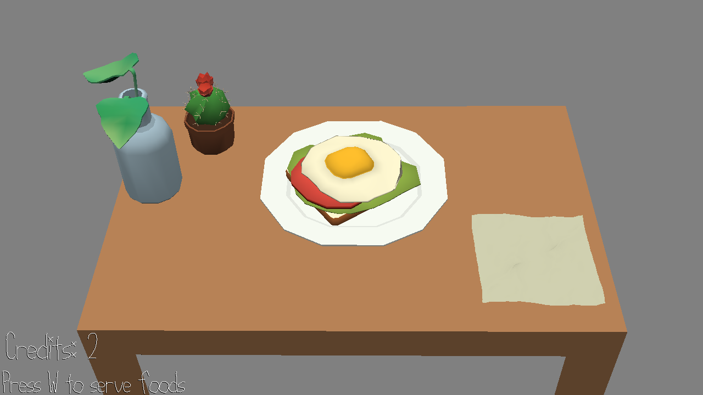

# Work in Restaurant

Author: YF

Design: 

- What's it like working at a restaurant? You need to decide what to do and respond quickly when you see the dishes.

Screen Shot:

How To Play:

- Press W to serve foods.
- Press SPACE to wipe the stain. Press S to check the back of the dish. Press A to finish the dish.

Sources:

- brunch.blend -- Yixin He. may be used/modified under a Creative Commons Attribution license.

This game was built with [NEST](NEST.md).

